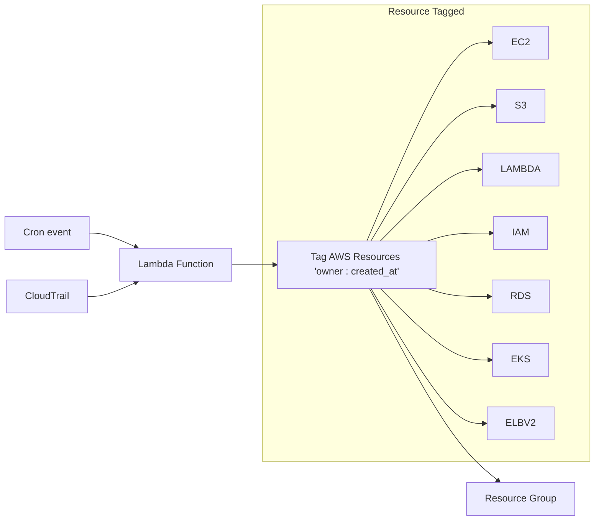

# AWS CloudTrail Resource Tagger

Automatically tags AWS resources based on CloudTrail events. When someone creates a resource in AWS, this tool automatically adds tags to identify the owner and creation time.

**What it does**
- Monitors CloudTrail events for resource creation
- Based on resource creation event it automatically tags those resources with owner and creation time
- Supports AWS services (EC2, S3, Lambda, RDS, EKS, SES, SQS, ECS, Bedrock etc.)
- Runs as a scheduled Lambda function
Of course. Here is the corrected text with suggestions for improvement.


**Benefits**

- **Cost Management**: Better cost allocation through consistent tagging.
- **Resource Cleanup Reminders**: Helps **set reminders** for removing unwanted **resources** created by users in a testing account.
- **Efficiency**: No manual tagging needed.

## Table of Contents

- [AWS CloudTrail Resource Tagger](#aws-cloudtrail-resource-tagger)
  - [Table of Contents](#table-of-contents)
  - [Architecture](#architecture)
  - [Getting started](#getting-started)
    - [Pre-required tools](#pre-required-tools)
    - [Install packages](#install-packages)
    - [Test locally](#test-locally)
    - [Deploy to AWS Lambda with scheduling](#deploy-to-aws-lambda-with-scheduling)
  - [Supported AWS Services](#supported-aws-services)

## Architecture




## Getting started


### Pre-required tools
```
pip install uv pytest pre-commit

npm install -g serverless
```

### Install packages
```
# Install project required python packages
uv sync

# start venv
poetry shell
# or
source .venv/bin/activte
```

### Test locally

```
export AWS_PROFILE=<your-profile>

python -m src.main
```

### Deploy to AWS Lambda with scheduling

```
# This will deploy the cloudformation stack and the source code via serverless through config `serverless.yml`
sls deploy
```

## Supported AWS Services

The AWS Tagger automatically tags resources from the following AWS services:

- **Compute**: EC2, Lambda, ECS, EKS
- **Storage**: S3, EFS, RDS, DynamoDB, Redshift
- **Networking**: VPC, ELB, CloudFront, Route53
- **Security**: IAM, KMS, Secrets Manager, Cognito
- **Monitoring**: CloudWatch Logs, CloudWatch Alarms
- **Development**: API Gateway, Step Functions, CloudFormation
- **Analytics**: Glue, OpenSearch, Bedrock
- **Mobile**: Amplify
