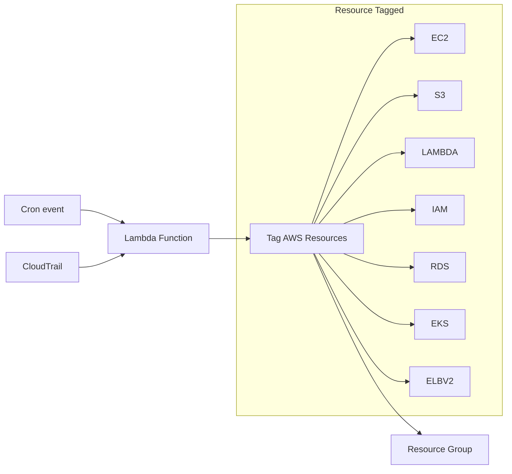

# AWS CloudTrail Resource Tagger

**Table of content**

## Architecture



## Supported AWS Services

The AWS Tagger automatically tags resources from the following AWS services:

- **Compute**: EC2, Lambda, ECS, EKS
- **Storage**: S3, EFS, RDS, DynamoDB, Redshift
- **Networking**: VPC, ELB, CloudFront, Route53
- **Security**: IAM, KMS, Secrets Manager, Cognito
- **Monitoring**: CloudWatch Logs, CloudWatch Alarms
- **Development**: API Gateway, Step Functions, CloudFormation
- **Analytics**: Glue, OpenSearch, Bedrock
- **Mobile**: Amplify

You can create AWS RESOURCE group
## Getting started


### Pre-required tools
```
pip install uv
npm install -g serverless
```

### Install packages
```
uv sync

# start venv

poetry shell
# or

source .venv/bin/activte
```

### Test locally

```
export AWS_PROFILE=<your-profile>

python -m src.main
```

### Deploy to AWS Lambda with scheduling

```
# This will deploy the cloudformation stack and the source code via serverless through config `serverless.yml`
sls deploy
```
