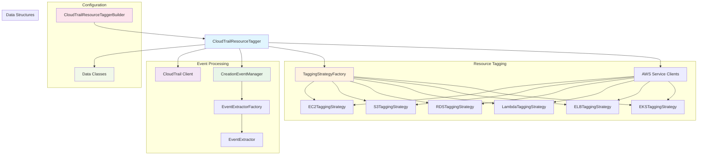
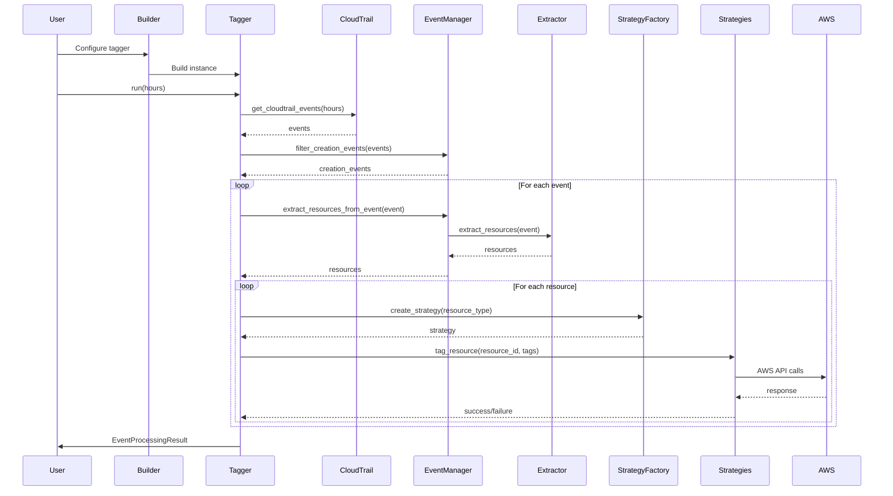

# AWS CloudTrail Resource Tagger Architecture



## Detailed Flow



## Component Relationships

```mermaid
classDiagram
    class CloudTrailResourceTaggerBuilder {
        +set_region()
        +with_creation_event_manager()
        +with_tagging_config()
        +add_path_extractor()
        +add_function_extractor()
        +build()
    }
    
    class CloudTrailResourceTagger {
        +get_cloudtrail_events()
        +filter_creation_events()
        +process_events()
        +tag_resource()
        +get_event_summary()
        +run()
    }
    
    class CreationEventManager {
        +is_creation_event()
        +extract_resources_from_event()
        +add_path_based_extractor()
        +add_function_based_extractor()
    }
    
    class EventExtractorFactory {
        +create_extractor()
        +register_extractor_config()
        +register_custom_extractor()
    }
    
    class EventExtractor {
        +extract_resources()
    }
    
    class TaggingStrategyFactory {
        +create_strategy()
    }
    
    class TaggingStrategy {
        <<abstract>>
        +tag_resource()
    }
    
    class TaggingConfig {
        +owner_tag_name
        +creation_time_tag_name
        +additional_tags
    }
    
    class ResourceInfo {
        +resource_type
        +resource_id
        +event_name
        +username
    }
    
    class TaggingStats {
        +processed
        +tagged
        +errors
        +success_rate
    }
    
    class EventProcessingResult {
        +stats
        +resources
        +start_time
        +end_time
    }
    
    CloudTrailResourceTaggerBuilder --> CloudTrailResourceTagger
    CloudTrailResourceTagger --> CreationEventManager
    CloudTrailResourceTagger --> TaggingStrategyFactory
    CloudTrailResourceTagger --> TaggingConfig
    CreationEventManager --> EventExtractorFactory
    EventExtractorFactory --> EventExtractor
    CloudTrailResourceTagger --> TaggingStrategyFactory
